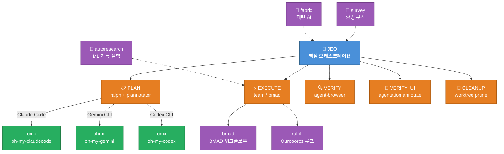
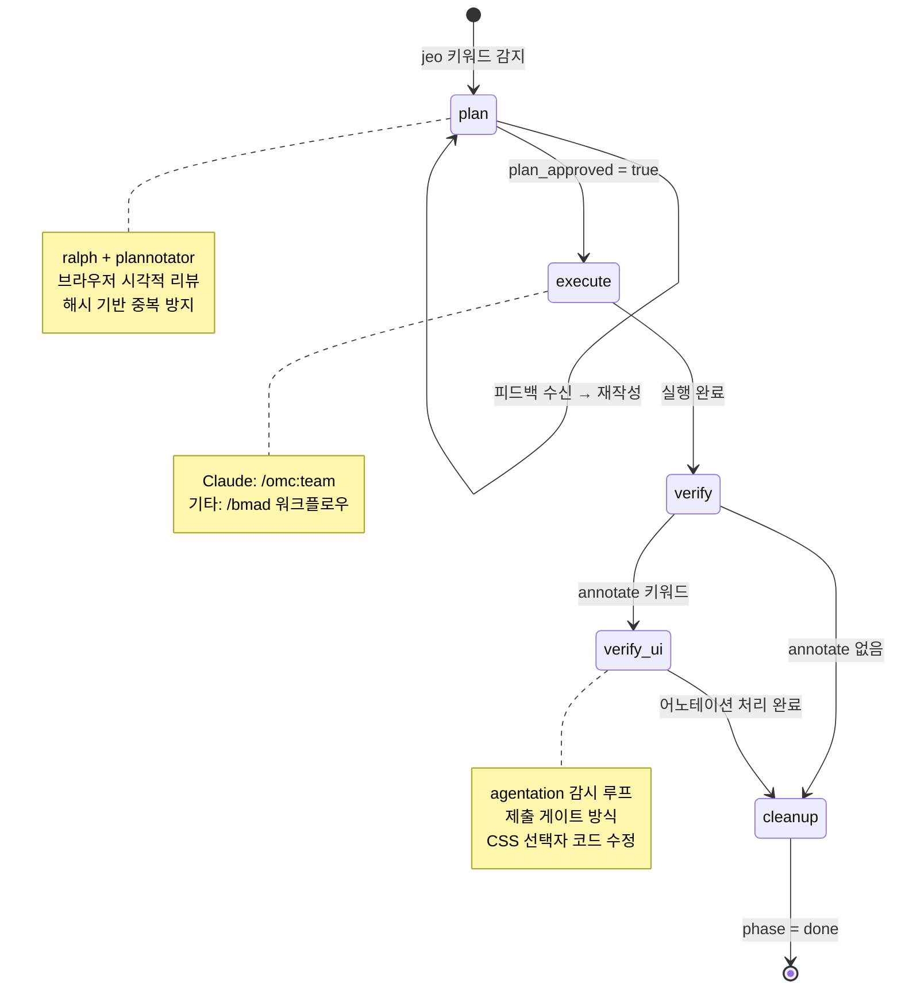

# oh-my-gods

<div align="center">

[](https://github.com/JEO-tech-ai/oh-my-gods)
[](https://github.com/JEO-tech-ai/oh-my-gods)
[](LICENSE)
[](CHANGELOG.md)
[](https://github.com/langchain-ai/langchain-skills)

</div>

```
   ___  _   _       __  ____   __  ___   ___  ___
  / _ \| | | |     |  \/  \ \ / / / __| / _ \|   \
 | (_) | |_| |  _  | |\/| |\ V /  | (_ || (_) | |) |
  \___/ \___/  (_) |_|  |_| |_|    \___| \___/|___/
```

<div align="center">

**LLM 기반 AI 에이전트 개발을 위한 완전한 워크플로우 & 스킬셋**

*Plan → Execute → Verify → Ship*

[빠른 시작](#빠른-시작-llm-에이전트용) · [JEO 핵심](#jeo--핵심-오케스트레이션-스킬) · [숨겨진 기능](#숨겨진-강력-기능) · [LangChain](#langchain-통합) · [전체 카탈로그](#전체-스킬-카탈로그) · [English](README.md)

</div>

---

## oh-my-gods란?

`oh-my-gods`는 LLM 기반 개발 워크플로우를 위한 **85개 이상의 AI 에이전트 스킬** 모음입니다. `jeo` 오케스트레이션 프로토콜을 중심으로 구성되어 있으며 다음을 제공합니다:

- **통합 오케스트레이션** — Claude Code, Gemini CLI, OpenAI Codex, OpenCode 지원
- **Plan → Execute → Verify → Cleanup** 자동화 파이프라인
- **멀티에이전트 팀 협업** 및 병렬 실행
- **LangChain/LangGraph 통합** — 프레임워크 인식 에이전트 개발

---

## 빠른 시작 (LLM 에이전트용)

> **사전 조건**: `npx skills add` 명령 실행 전에 반드시 `skills` CLI를 설치하세요.

```bash
npm install -g skills
```

```bash
# LLM 에이전트에게 이 가이드를 전달하면 자동 설치를 진행합니다
curl -s https://raw.githubusercontent.com/JEO-tech-ai/oh-my-gods/main/setup-all-skills-prompt.md
```

또는 원라인으로 설치:

```bash
curl -fsSL https://raw.githubusercontent.com/JEO-tech-ai/oh-my-gods/main/install.sh | bash
```

더 많은 스킬 설치 → [설치 레퍼런스](#설치-레퍼런스) | 플랫폼별 가이드 → [플랫폼 지원](#플랫폼-지원)

---

## 아키텍처



---

## JEO — 핵심 오케스트레이션 스킬

> **키워드**: `jeo` · `annotate` · `UI검토`
> **oh-my-gods의 중추 신경계**

JEO는 모든 AI 에이전트 플랫폼에서 완전 자동화된 개발 파이프라인을 오케스트레이션합니다.

```
┌─────────────────────────────────────────────────────────────────┐
│                     JEO 워크플로우                               │
├──────────┬──────────┬──────────┬──────────┬────────────────────┤
│  STEP 0  │  STEP 1  │  STEP 2  │  STEP 3  │  STEP 4            │
│ 부트스트랩│   PLAN   │ EXECUTE  │  VERIFY  │  CLEANUP           │
│          │          │          │          │                    │
│ 상태 초기화│ ralph   │ omc:team │ agent-   │ worktree           │
│          │    +     │    or    │ browser  │ prune              │
│          │planno-   │  bmad    │    +     │                    │
│          │ tator    │          │agenta-   │                    │
│          │          │          │ tion     │                    │
└──────────┴──────────┴──────────┴──────────┴────────────────────┘
```

### JEO 상태 머신



### 플랫폼 지원

| 플랫폼 | 팀 모드 | PLAN 게이트 | VERIFY_UI | 설치 |
|--------|---------|------------|-----------|------|
| **Claude Code** | `/omc:team` | ExitPlanMode 훅 | MCP 도구 | `bash setup-claude.sh` |
| **Gemini CLI** | `ohmg` | AfterAgent 훅 | HTTP REST | `bash setup-gemini.sh` |
| **Codex CLI** | `omx` | notify 훅 | HTTP REST | `bash setup-codex.sh` |
| **OpenCode** | `omx` | submit_plan 플러그인 | HTTP REST | `bash setup-opencode.sh` |

---

## 숨겨진 강력 기능

> 이 기능들이 oh-my-gods의 진정한 잠재력을 발휘합니다.

```
╔══════════════════════════════════════════════════════════════════╗
║                숨겨진 강력 기능                                   ║
╠══════════════╦═══════════════════════════════════════════════════╣
║  omc         ║  Claude Code 32개 에이전트 오케스트레이션         ║
║  omx         ║  OpenAI Codex 멀티에이전트 오케스트레이션         ║
║  ohmg        ║  Gemini / Antigravity 워크플로우 (Google AI)     ║
║  bmad        ║  단계 기반 구조적 개발 (BMAD 방법론)              ║
║  bmad-idea   ║  창의적 AI — 5개 전문 아이디에이션 에이전트       ║
║  survey      ║  구현 전 환경 분석 스캔                           ║
║  autoresearch║  자율 야간 ML 실험 (Karpathy 방법론)              ║
║  fabric      ║  재사용 패턴 기반 AI 프롬프트 오케스트레이션 CLI  ║
║  agentation  ║  UI 어노테이션 → 에이전트 코드 수정 (annotate)   ║
║  plannotator ║  시각적 계획/diff 리뷰 브라우저 UI               ║
║  agent-browser║ AI 에이전트용 헤드리스 브라우저 검증             ║
║  playwriter  ║  실제 브라우저 연결 Playwright 자동화             ║
╚══════════════╩═══════════════════════════════════════════════════╝
```

| 스킬 | 키워드 | 설명 | 출처 |
|------|--------|------|------|
| `omc` | `omc`, `autopilot` | 32개 특화 에이전트, 스마트 모델 라우팅, 실시간 HUD | [oh-my-claudecode](https://github.com/Yeachan-Heo/oh-my-claudecode) |
| `omx` | `omx` | 40개+ 워크플로우 스킬, tmux 팀 오케스트레이션 | 내부 |
| `ohmg` | `ohmg` | Google Antigravity/Gemini 멀티에이전트 프레임워크 | 내부 |
| `bmad` | `bmad`, `/workflow-init` | 분석→계획→솔루션→구현 구조화 단계 | [BMAD Method](https://github.com/bmad-dev/BMAD-METHOD) |
| `bmad-idea` | `bmad-idea` | 5개 창의적 전문 에이전트 — 디자인 씽킹, 혁신, 스토리텔링 | 내부 |
| `survey` | `survey` | 구현 전 크로스 플랫폼 환경 분석; `.survey/`에 결과물 저장 | 내부 |
| `autoresearch` | `autoresearch`, `val_bpb` | Karpathy 스타일 자율 GPU 야간 실험 및 git 래칫 | Karpathy 방법론 |
| `fabric` | `fabric` | 재사용 패턴 AI 프롬프트; YouTube 요약, 문서 분석 | [fabric](https://github.com/danielmiessler/fabric) |
| `agentation` | `annotate`, `UI검토` | UI 요소 클릭 → AI가 CSS 선택자로 코드 수정 | [agentation](https://github.com/benjitaylor/agentation) |
| `plannotator` | `plan` | AI 생성 계획 브라우저 리뷰 UI; 승인 또는 피드백 전송 | [plannotator](https://plannotator.ai) |
| `agent-browser` | `agent-browser` | AI 에이전트용 헤드리스 브라우저 스냅샷 및 검증 | npm:agent-browser |
| `playwriter` | `playwriter` | 실행 중인 브라우저에 연결하는 Playwright 자동화 | 내부 |

---

## LangChain 통합

> **출처**: [`langchain-ai/langchain-skills`](https://github.com/langchain-ai/langchain-skills/tree/main)
> MIT 라이선스 — LangChain AI 공식 에이전트 개발 스킬

oh-my-gods는 공식 LangChain 스킬 컬렉션을 통합하여 LangChain/LangGraph/Deep Agents 애플리케이션 개발에 필요한 프레임워크 인식 가이던스를 제공합니다.

### 설치

```bash
# 모든 LangChain 스킬 설치
npx skills add langchain-ai/langchain-skills --skill '*' --yes
```

### 프레임워크 선택 가이드

| 사용 사례 | 권장 프레임워크 |
|----------|--------------|
| 다단계 작업, 파일 관리, 온디맨드 스킬 | **Deep Agents** |
| 복잡한 제어 흐름 (루프, 분기, 병렬화) | **LangGraph** |
| 도구를 사용하는 단순 단일 에이전트 | **LangChain** `create_agent()` |
| 순수 모델 호출 / 검색 파이프라인 | **LangChain LCEL** |

### LangChain 스킬 목록

| 스킬 | 트리거 | 설명 |
|------|--------|------|
| `framework-selection` | "어떤 프레임워크", "LangChain vs" | LangChain/LangGraph/Deep Agents 선택 |
| `langchain-dependencies` | "langchain 설치", "패키지 버전" | 패키지 설정 및 버전 관리 |
| `langchain-fundamentals` | "langchain agent", "create_agent" | 에이전트 생성, @tool 데코레이터, 구조화 출력 |
| `langchain-middleware` | "human in the loop", "승인 워크플로우" | HITL 승인, 커스텀 미들웨어 |
| `langchain-rag` | "RAG", "검색", "벡터 스토어" | 완전한 RAG 파이프라인 구현 |
| `langgraph-fundamentals` | "langgraph", "StateGraph" | 그래프 노드, 엣지, 스트리밍 |
| `langgraph-persistence` | "상태 유지", "checkpointer" | 상태 영속성, PostgresSaver |
| `langgraph-human-in-the-loop` | "interrupt", "승인 대기" | `interrupt()`, `Command(resume=...)`, 멱등성 |
| `deep-agents-core` | "deep agent", "create_deep_agent" | 핵심 아키텍처, 미들웨어, SKILL.md 형식 |
| `deep-agents-memory` | "에이전트 메모리", "StoreBackend" | 메모리 백엔드: 임시, 영속, 파일시스템 |
| `deep-agents-orchestration` | "서브에이전트", "할 일 목록" | SubAgentMiddleware, TodoListMiddleware, HITL |

---

## 전체 스킬 카탈로그

### 핵심 오케스트레이션

| 스킬 | 키워드 | 플랫폼 | 설명 |
|------|--------|--------|------|
| `jeo` | `jeo` | 전체 | 통합 오케스트레이션: PLAN→EXECUTE→VERIFY→CLEANUP |
| `omc` | `omc`, `autopilot` | Claude Code | 32개 에이전트 멀티에이전트 오케스트레이션 레이어 |
| `omx` | `omx` | Codex CLI | 40개+ 워크플로우 스킬, tmux 팀 오케스트레이션 |
| `ohmg` | `ohmg` | Gemini CLI | Antigravity 멀티에이전트 프레임워크 |
| `ralph` | `ralph`, `ooo` | 전체 | Ouroboros 명세 우선 + 영속 완료 루프 |
| `ralphmode` | `ralphmode` | 전체 | 자동화 권한 프로파일 (샌드박스 우선, 저장소 경계) |
| `bmad` | `bmad`, `/workflow-init` | 전체 | 단계 기반 AI 구조적 개발 |
| `bmad-idea` | `bmad-idea` | 전체 | 창의적 지능 — 5개 전문 아이디에이션 에이전트 |
| `survey` | `survey` | 전체 | 구현 전 환경 분석 스캔 |

### 계획 & 리뷰

| 스킬 | 키워드 | 설명 |
|------|--------|------|
| `plannotator` | `plan` | 시각적 브라우저 계획/diff 리뷰 |
| `agentation` | `annotate`, `UI검토` | UI 어노테이션 → 타겟 코드 수정 |
| `agent-browser` | `agent-browser` | 헤드리스 브라우저 검증 |
| `playwriter` | `playwriter` | 실제 브라우저 연결 Playwright |
| `vibe-kanban` | `kanbanview` | 에이전트 작업 시각적 칸반 보드 |

### 개발 워크플로우

| 스킬 | 설명 |
|------|------|
| `agent-development-principles` | 보편적 AI 협업 원칙 (분할정복, 컨텍스트 관리) |
| `agent-principles` | AI 에이전트 협업 핵심 원칙 |
| `agent-workflow` | 일상 워크플로우 최적화: 단축키, Git, MCP, 세션 |
| `agent-configuration` | 에이전트 정책, 보안, 훅/스킬/플러그인 설정 |
| `agent-evaluation` | 종합 에이전트 평가 시스템 설계 |
| `git-workflow` | 커밋, 브랜치, 머지, PR 워크플로우 |
| `debugging` | 근본 원인 분석, 회귀 격리 |

---

## 설치 레퍼런스

### 전체 설치 (권장)

```bash
# 사전 조건
npm install -g skills

# 원라인 설치 (권장)
curl -fsSL https://raw.githubusercontent.com/JEO-tech-ai/oh-my-gods/main/install.sh | bash

# 또는 수동 설치
npx skills add https://github.com/JEO-tech-ai/oh-my-gods \
  --skill agent-configuration --skill agent-evaluation \
  --skill agent-development-principles --skill agent-principles \
  --skill agent-workflow --skill bmad --skill bmad-gds --skill bmad-idea \
  --skill jeo --skill ralph --skill ralphmode --skill omc --skill omx --skill ohmg \
  --skill plannotator --skill agentation --skill agent-browser --skill playwriter \
  --skill survey --skill fabric --skill autoresearch \
  --skill vibe-kanban --skill opencontext \
  --skill api-design --skill api-documentation --skill authentication-setup \
  --skill backend-testing --skill database-schema-design \
  --skill debugging --skill code-review --skill security-best-practices \
  --skill git-workflow --skill deployment-automation

# LangChain 스킬 (선택 사항)
npx skills add langchain-ai/langchain-skills --skill '*' --yes
```

### 플랫폼별 설정

```bash
# Claude Code
/plugin marketplace add https://github.com/Yeachan-Heo/oh-my-claudecode
/omc:omc-setup
bash ~/.agent-skills/jeo/scripts/setup-claude.sh

# Gemini CLI
bash ~/.agent-skills/jeo/scripts/setup-gemini.sh

# Codex CLI
bash ~/.agent-skills/jeo/scripts/setup-codex.sh

# OpenCode
bash ~/.agent-skills/jeo/scripts/setup-opencode.sh
```

### 플랫폼별 첫 실행 명령

| 플랫폼 | 명령 |
|--------|------|
| Claude Code | `jeo "작업 설명"` 또는 `/omc:team "작업"` |
| Gemini CLI | `/jeo "작업 설명"` |
| Codex CLI | `/jeo "작업 설명"` |
| OpenCode | `/jeo "작업 설명"` |

---

## 환경 요구사항

```bash
# 필수
node >= 18
git
bash

# 선택 (플랫폼별)
bun              # 빠른 설치
docker           # 컨테이너 워크플로우
npm install -g skills  # skills CLI (필수)
npx agentation-mcp server  # UI 어노테이션
npm install -g agent-browser  # 브라우저 검증
```

---

## 참고 & 출처

| 컴포넌트 | 출처 | 라이선스 |
|----------|------|---------|
| `jeo` | [supercent-io/skills-template](https://github.com/supercent-io/skills-template) | MIT |
| `omc` | [Yeachan-Heo/oh-my-claudecode](https://github.com/Yeachan-Heo/oh-my-claudecode) | MIT |
| `ralph` | [Q00/ouroboros](https://github.com/Q00/ouroboros) | MIT |
| `plannotator` | [backnotprop/plannotator](https://plannotator.ai) | MIT |
| `bmad` | [bmad-dev/BMAD-METHOD](https://github.com/bmad-dev/BMAD-METHOD) | MIT |
| `agentation` | [benjitaylor/agentation](https://github.com/benjitaylor/agentation) | MIT |
| `fabric` | [danielmiessler/fabric](https://github.com/danielmiessler/fabric) | MIT |
| `autoresearch` | Andrej Karpathy 방법론 | — |
| LangChain 스킬 | [langchain-ai/langchain-skills](https://github.com/langchain-ai/langchain-skills) | MIT |
| 에이전트 개발 원칙 | [ykdojo/claude-code-tips](https://github.com/ykdojo/claude-code-tips) + Ado Kukic | MIT |
| Agent Skills Spec | [agentskills.io](https://agentskills.io/specification) | — |

---

<div align="center">

[supercent-io](https://github.com/supercent-io) 및 커뮤니티가 만든 프로젝트

⭐ 도움이 되셨다면 저장소에 별을 눌러주세요!

```bash
gh api --silent --method PUT /user/starred/JEO-tech-ai/oh-my-gods >/dev/null 2>&1
```

</div>
